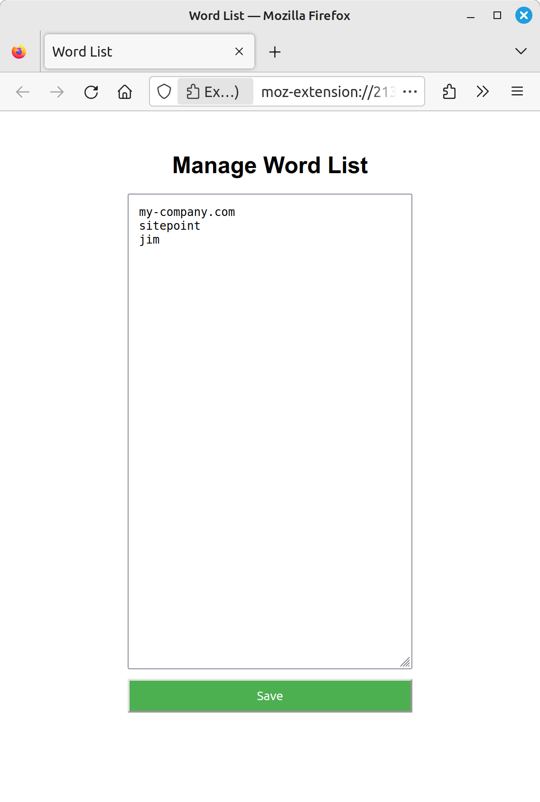
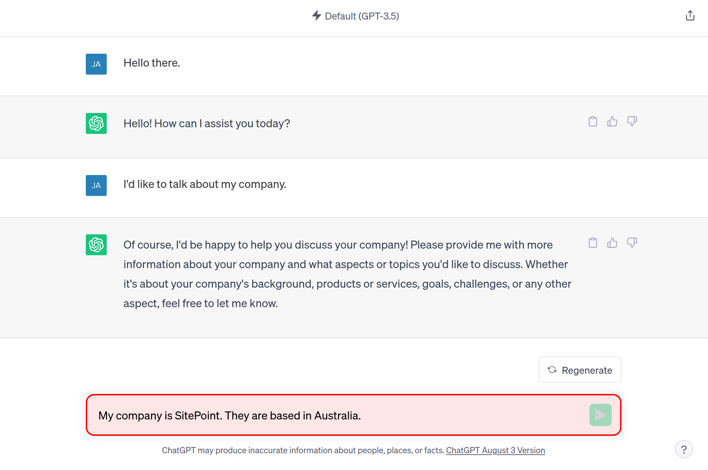

# ChatGPT Molly-Guard

A Firefox extension which helps prevent the sharing of sensitive information with ChatGPT.

## Installation

To load the unpacked extension:

1. Clone the repo
2. Open Firefox and type `about:debugging` in the address bar
3. Click _This Firefox_
4. Click _Load Temporary Add-on..._
5. Navigate to the cloned repo and select the `manifest.json` file.

If everything is set up correctly, your extension should now be loaded, and you can inspect it, reload it, or remove it using the buttons next to its entry.

To configure the extension to run:

6. Open ChatGPT in your browser
7. Firefox's extensions icon in the browser toolbar will have a dot beneath it
8. Left click the icon, then click on the cog
9. Select _Always Allow on chat.openai.com_
10. Select _Pin to Toolbar_

You should now be able to use the extension.

## Usage

Clicking on the extension's icon will allow you to specify a list of words that will be monitored for. If any of these words are detected in the chat window, submission will be disabled.

To override the molly-guard's functionality for one submission, double press the <kbd>Escape</kbd> key.

  
Screenshots

  
  

## License

Licensed under the MIT license.

Copyright © 2023 James Hibbard

Permission is hereby granted, free of charge, to any person obtaining a copy of this software and associated documentation files (the "Software"), to deal in the Software without restriction, including without limitation the rights to use, copy, modify, merge, publish, distribute, sublicense, and/or sell copies of the Software, and to permit persons to whom the Software is furnished to do so, subject to the following conditions:

The above copyright notice and this permission notice shall be included in all copies or substantial portions of the Software.

THE SOFTWARE IS PROVIDED "AS IS", WITHOUT WARRANTY OF ANY KIND, EXPRESS OR IMPLIED, INCLUDING BUT NOT LIMITED TO THE WARRANTIES OF MERCHANTABILITY, FITNESS FOR A PARTICULAR PURPOSE AND NONINFRINGEMENT. IN NO EVENT SHALL THE AUTHORS OR COPYRIGHT HOLDERS BE LIABLE FOR ANY CLAIM, DAMAGES OR OTHER LIABILITY, WHETHER IN AN ACTION OF CONTRACT, TORT OR OTHERWISE, ARISING FROM, OUT OF OR IN CONNECTION WITH THE SOFTWARE OR THE USE OR OTHER DEALINGS IN THE SOFTWARE.
